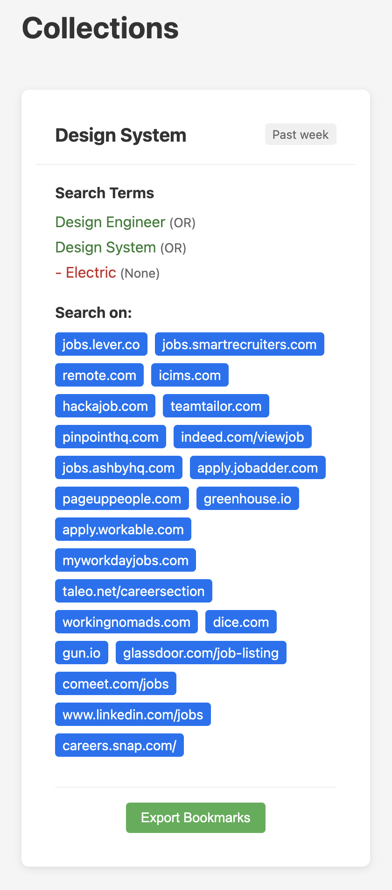
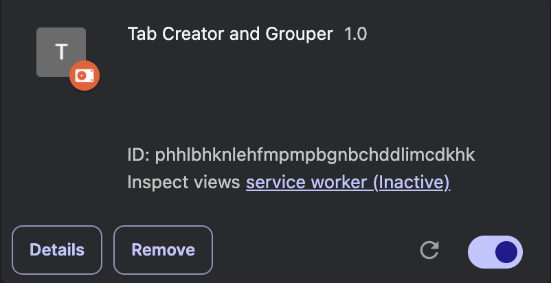
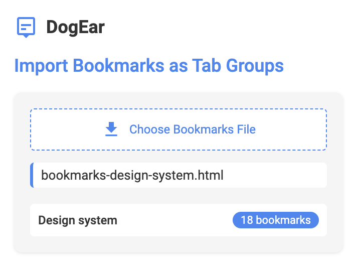

# DogEar Jobs

A Google site keyword job search tool to generate bookmarks or tab groups for job postings.

## Features

- Search for job postings on Google using keywords.
- Generate bookmarks or tab groups for the search results.
- Save bookmarks or tab groups for later use.

## Requirements

- Google Chrome or any other web browser that supports bookmarks.

## Installation

This project uses Yarn for package management. To install the dependencies, run the following command:

```bash
yarn install
```

## Projects

This project consistes of three parts:

- **Server**: A Strap API server that handles the backend logic and serves the frontend.
- **Client**: A Next.js frontend that provides the user interface for the tool.
- **Extension**: A Chrome extension that allows users to save bookmarks or tab groups directly from the browser.

## Usage

1. Start the server and client by running the following command in the `server` directory:

```bash
yarn dev
```

2. Open the client in your web browser by navigating to `http://localhost:3000`.

## Screenshots

### Client collections

Example of the client collections page, where users can view and manage their saved bookmarks or tab groups.



### Extension settings

The extension loaded in Brave browser.  


### Extension - Bookmarks uploaded

The extension allows users to upload bookmarks or tab groups directly from the browser. This feature is useful for quickly saving job postings without leaving the current page.


